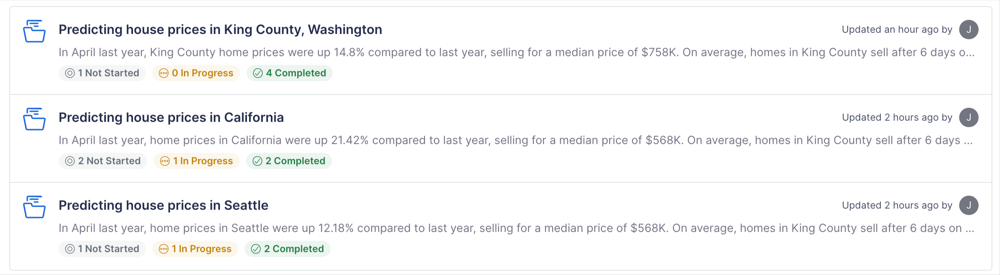

# 1️⃣ Intro

This tutorial will give you an overview of Vectice and explore its capabilities step by step. Throughout this tutorial, we will use both the Web UI of Vectice and the Python API.

This guide will show you how to:

1. Install the Vectice client library for Python
2. Authenticate to Vectice
3. Create your experiment
4. Create a run to capture your essential milestones

By the end of it, you'll see metadata tracked to your first run in Vectice!

Before we get started, make sure you have the following:

* [x] Understood the Vectice concepts
* [x] Established a Vectice account
* [x] A Python notebook editor like Jupyter with Vectice Python API installed.

If you have checked all the above, lets’ get started!

### **Getting Started**

First, log in to the Vectice web application and understand a bit. Your home page will show you your most recent activity, and you can jump right back where you left off. You’ll also see a link to these learning resources.

The homepage is accessible anywhere in the app through the Vectice logo, located in the top-left corner of the web application.

But first, let’s get started with your Workspaces.

### **Workspaces**

Every Vectice account receives a private or personal workspace for you to play around with Vectice and experiment. This workspace name is derived from the first part of your username. Alongside, you’ll notice a workspace named “Samples” that contains the assets from our tutorial.

>)

You may click on the workspace name to open it and see the various projects in the workspace along with their progress.

### **Projects**

You can see what’s going on with a project by clicking on it. A project reflects a typical Machine Learning project with its objectives and associated resources like datasets, models, and documentation.

<figure><figcaption></figcaption></figure>
